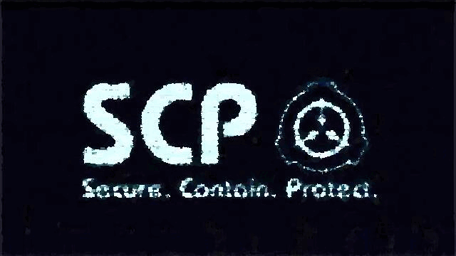

# free-scp-skill

<div align="center">
  
</div>

A Claude Code Agent Skill for searching, referencing, and analyzing SCP Foundation collaborative fiction. Designed to help writers find similar concepts, avoid duplicate tropes, and spark new ideas.

## Features

- **Semantic search** across SCP items using natural language
- **Overlap / trope detection** to help writers avoid unintentional duplication
- **Local-first architecture**: all data and embeddings are stored on your machine
- **CC-BY-SA compliant**: every result includes original URL and author attribution

## Prerequisites

- Python 3.9+
- `pip` package manager

## Installation

1. Install Python dependencies:
   ```bash
   pip install -r requirements.txt
   ```
   > On Windows, if you encounter compilation errors, install [Microsoft C++ Build Tools](https://visualstudio.microsoft.com/visual-cpp-build-tools/) first, then retry.

2. **Run the interactive configuration wizard** (one-time):
   ```bash
   python tools/configure.py
   ```
   This lets you choose:
   - **Vector DB storage location** (default user directory, project directory, or custom path)
   - **Embedding model** (`all-MiniLM-L6-v2` for speed, `all-mpnet-base-v2` for higher accuracy, or multilingual variants)

3. **Initialize the local SCP database** (one-time, takes ~10–30 min depending on hardware and network):
   ```bash
   python tools/init_db.py
   ```
   This downloads metadata and content from [scp-data.tedivm.com](https://scp-data.tedivm.com) and builds a ChromaDB vector index at the location you configured.

## Usage

### Search

```bash
python tools/search_scp.py "time loop anomaly in a hospital"
```

### Check for duplicates / overlaps

```bash
python tools/check_duplicates.py "a mirror that shows the viewer their own corpse"
```

### Update the index (planned)

```bash
python tools/update_db.py
```

## Data & License

All SCP content is licensed under [CC-BY-SA 3.0](https://creativecommons.org/licenses/by-sa/3.0/). This skill respects that license by always returning attribution and original URLs.

The data source is [scp-data.tedivm.com](https://scp-data.tedivm.com).

## Changing Configuration Later

To update your vector DB path or switch embedding models, re-run:

```bash
python tools/configure.py
```

> **Note:** If you change the embedding model, you must delete the existing vector database and re-run `python tools/init_db.py`, because different models produce incompatible vector spaces.

## Project Structure

```
free-scp-skill/
├── SKILL.md              # Claude Code skill manifest
├── README.md             # This file
├── requirements.txt      # Python dependencies
├── config_utils.py       # Shared configuration helpers
└── tools/
    ├── configure.py      # Interactive setup wizard
    ├── init_db.py        # Build local vector index
    ├── search_scp.py     # Semantic search
    └── check_duplicates.py  # Overlap detection
```
